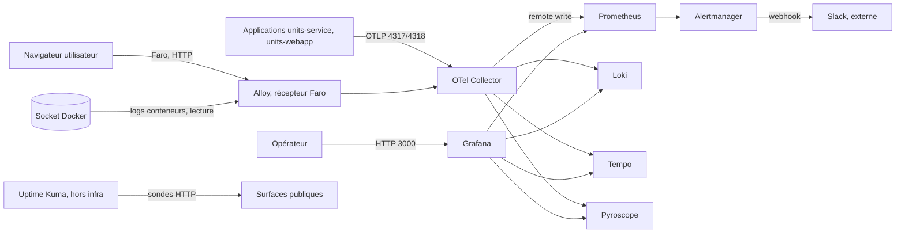

# Modèle de menace

Ce document identifie ce que la plateforme d'observabilité doit protéger, par où passent les données, et quelles menaces pèsent sur chaque frontière. Il suit la grille STRIDE, qui classe les menaces en six familles : usurpation d'identité, altération, répudiation, divulgation d'information, déni de service et élévation de privilège. Il distingue à chaque fois les mitigations déjà en place de celles qui sont planifiées, notamment dans le lot de durcissement.

L'analyse porte sur l'état courant, qui est une configuration de laboratoire. Beaucoup de menaces ci-dessous sont réelles précisément parce que le durcissement n'est pas encore fait. Elles ne sont pas des défauts cachés mais des choix assumés et documentés, à traiter avant toute exposition.

## Actifs à protéger

Le premier actif est la télémétrie elle-même, c'est à dire les métriques, les logs, les traces et les profils. Elle peut contenir des données sensibles, par exemple des identifiants d'utilisateur, des chemins ou des fragments de requêtes. Viennent ensuite les secrets, à savoir les mots de passe de Grafana et de GlitchTip, le webhook Slack et les clés applicatives. Comptent également l'intégrité des alertes, car une alerte falsifiée ou étouffée crée un angle mort dangereux, la confidentialité des tableaux de bord, qui révèlent le fonctionnement interne du système, et enfin la disponibilité de la plateforme, puisqu'une supervision aveugle ou à l'arrêt laisse les incidents passer inaperçus.

## Flux de données et frontières de confiance

Les principales frontières de confiance sont le passage du navigateur vers la plateforme, le passage des applications vers le Collector, le passage du Collector vers les backends de stockage, l'accès de l'opérateur à Grafana, la sortie d'Alertmanager vers Slack, et le regard de la sonde externe sur les surfaces publiques. Chacune est un endroit où des données changent de niveau de confiance, donc un endroit à contrôler.

## Analyse STRIDE

### Usurpation d'identité

Le point d'entrée OTLP du Collector accepte aujourd'hui toute télémétrie sans authentifier l'émetteur. N'importe quel hôte capable d'atteindre le port peut donc injecter des métriques, des logs ou des traces, et fausser les tableaux de bord ou déclencher de fausses alertes. Le récepteur des données du navigateur accepte toutes les origines, ce qui aggrave le risque côté frontend. La mitigation actuelle repose entièrement sur le cloisonnement réseau, en supposant que seuls des émetteurs légitimes atteignent ces ports. Le durcissement prévoit une authentification du point d'entrée, un contrôle strict des origines acceptées, et à terme une identité mutuelle entre composants.

### Altération

En l'absence de TLS, la télémétrie et les échanges internes circulent en clair et peuvent être modifiés en transit par un attaquant présent sur le réseau. La mitigation actuelle est là encore le réseau privé. Le durcissement introduit le chiffrement en transit via un reverse proxy TLS et, entre composants, des connexions sécurisées. Du côté des configurations et des règles, l'altération est contenue par la gouvernance Git, puisque toute modification passe par une branche, une revue et une intégration contrôlée, sur des branches protégées.

### Répudiation

La traçabilité des actions d'administration est limitée. Grafana journalise certains changements et Alertmanager conserve la trace des routages, mais il n'existe pas de journal d'audit centralisé et infalsifiable des accès et des modifications. Un opérateur pourrait donc agir sans laisser de trace exploitable. La mitigation visée est une journalisation d'audit centralisée, corrélée aux identités une fois l'authentification en place.

### Divulgation d'information

C'est la famille la plus sensible ici. La télémétrie peut contenir des données personnelles, et les tableaux de bord exposent le fonctionnement interne du système. Deux facteurs de risque coexistent. D'une part, les ports sont publiés sans authentification, si bien que quiconque atteint le réseau peut lire les métriques et les tableaux de bord. D'autre part, une instrumentation négligente pourrait faire remonter des données sensibles dans les signaux. Sur ce second point, des mitigations sont déjà actives : la discipline de cardinalité place les identifiants à forte cardinalité en attributs de trace et non en étiquettes de métrique, et le Collector applique une réduction des données sensibles, en supprimant par exemple les en-têtes d'autorisation et en masquant les identifiants d'utilisateur. Sur le premier point, la mitigation est le réseau privé aujourd'hui, et l'authentification plus le TLS demain. Les secrets, eux, sont tenus hors du dépôt et surveillés par le scan de secrets local.

### Déni de service

Le point d'entrée OTLP non authentifié peut être submergé de télémétrie, ce qui sature le Collector et les backends. Aucune limitation de débit n'est en place. Par ailleurs, la plateforme est mono-serveur, donc un point de défaillance unique : si la machine tombe, toute la supervision embarquée tombe avec elle. Deux mitigations existent ou sont prévues. La sonde Uptime Kuma, hébergée hors infrastructure, détecte justement la panne globale que la pile locale ne peut pas signaler, jouant le rôle de témoin indépendant. Le durcissement ajoutera une authentification et une limitation de débit à l'entrée, et la montée en charge vers un mode distribué lèvera le point de défaillance unique.

### Élévation de privilège

Les deux démonstrations tournent désormais sans privilège, en utilisateur non root, ce qui réduit l'impact d'une compromission applicative. Un point d'attention demeure : Alloy accède au socket Docker en lecture pour collecter les logs des conteneurs, et le socket Docker est une surface puissante. L'accès est en lecture seule, mais une compromission d'Alloy resterait sérieuse. Enfin, l'accès administrateur à Grafana doit être protégé par un mot de passe fort et, à terme, une authentification unique avec des rôles distincts, afin qu'un compte de consultation ne puisse pas devenir administrateur.

## Tableau récapitulatif priorisé

| Menace | Frontière ou composant | Gravité | Mitigation | État |
|---|---|---|---|---|
| Injection de télémétrie non authentifiée | Point d'entrée OTLP du Collector | Élevée | Authentification du point d'entrée, réseau privé | Réseau privé en place ; auth planifiée (#9) |
| Origines non restreintes côté navigateur | Récepteur Faro d'Alloy | Moyenne | Restreindre les origines au domaine du front | Planifiée (#9) |
| Écoute ou altération en transit | Tous les échanges internes | Élevée | TLS via reverse proxy, connexions sécurisées | Planifiée (#9) |
| Lecture non autorisée des tableaux de bord et métriques | Ports publiés sans auth | Élevée | Authentification et cloisonnement réseau | Réseau privé en place ; auth planifiée (#9) |
| Fuite de données sensibles dans les signaux | Instrumentation, Collector | Moyenne | Discipline de cardinalité, réduction au Collector | En place |
| Fuite de secrets | Dépôt, configurations | Élevée | Secrets hors Git, scan gitleaks au commit | En place |
| Absence de journal d'audit | Administration de la plateforme | Moyenne | Journalisation d'audit centralisée | Planifiée |
| Saturation du point d'entrée | Collector | Moyenne | Limitation de débit et authentification | Planifiée (#9) |
| Panne globale du serveur unique | Plateforme mono-serveur | Moyenne | Sonde externe indépendante, puis mode distribué | Sonde externe en place ; distribué ultérieur |
| Accès au socket Docker | Alloy | Moyenne | Accès en lecture seule, surveillance d'Alloy | Lecture seule en place |
| Élévation via un conteneur applicatif | Démonstrations | Faible | Exécution sans privilège | En place |
| Détournement du compte administrateur Grafana | Grafana | Moyenne | Mot de passe fort, authentification unique, rôles | Mot de passe en place ; SSO planifié (#9) |

## Portée et limites

Ce modèle couvre la plateforme telle qu'elle existe dans le dépôt. Il ne traite pas la sécurité physique des machines, la sécurité du poste des opérateurs, ni les aspects organisationnels comme la gestion des accès du personnel ou la réponse à incident formalisée, qui dépassent le périmètre du code. Il est destiné à évoluer à chaque changement d'architecture, en particulier lors du durcissement et du passage à un mode distribué.
